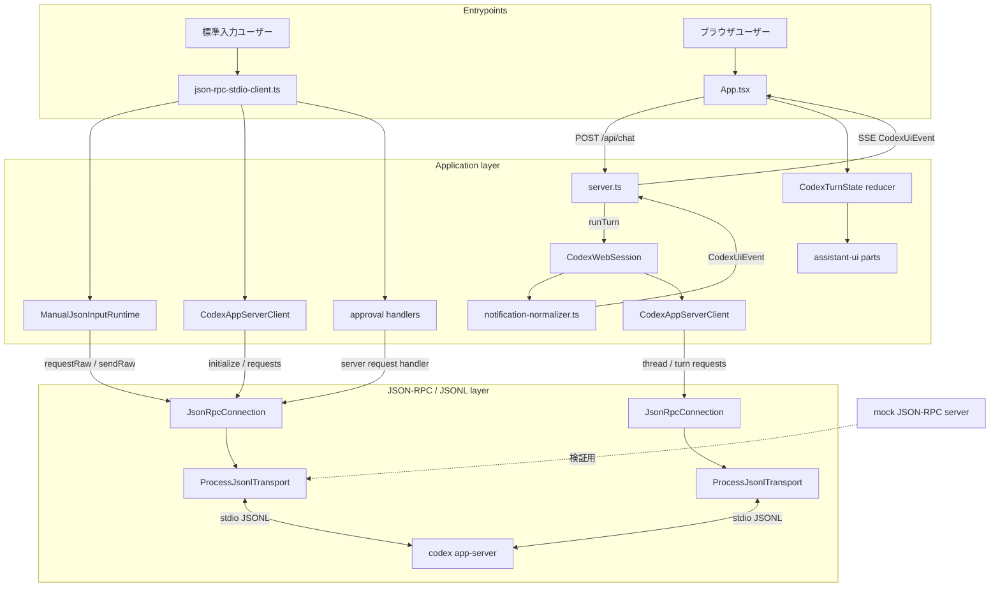
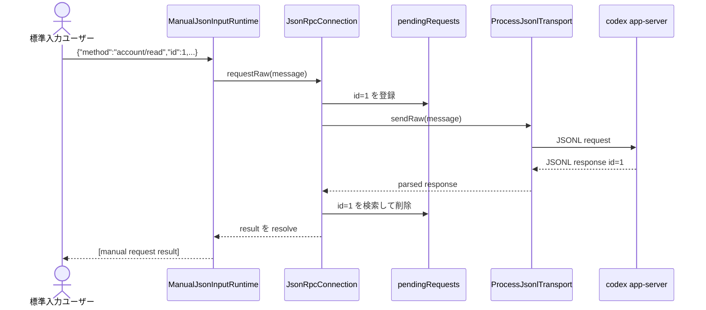
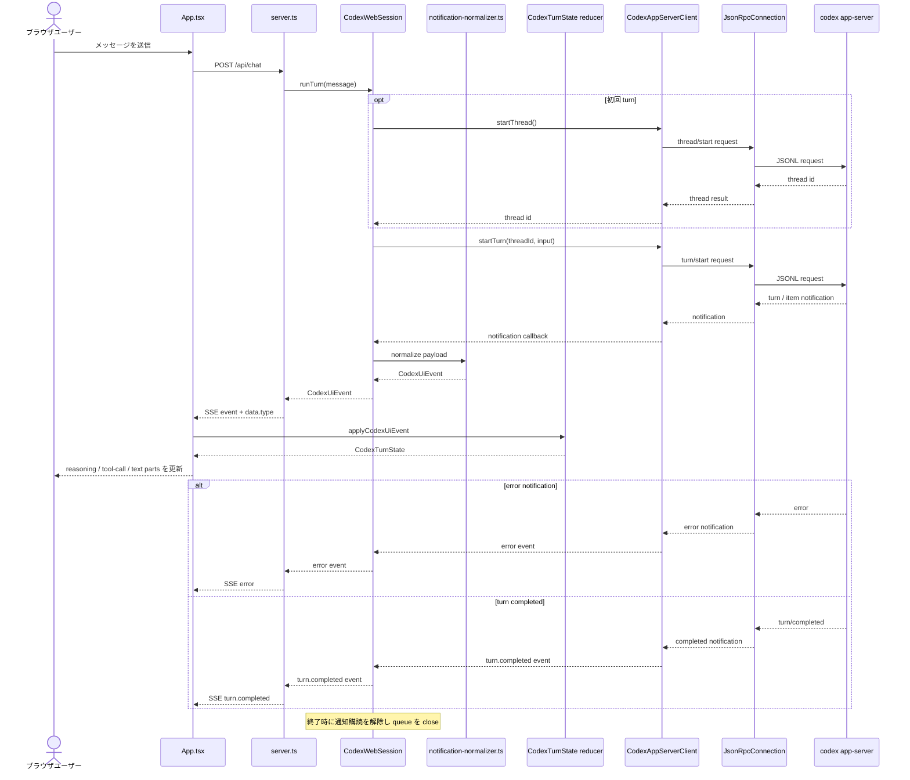

# simple-codex-client

Bun で動く Codex App Server / JSON-RPC JSONL 検証クライアントです。CLI からの手動 JSON-RPC 入力に加えて、assistant-ui ベースの Web UI から `/api/chat` 経由で Codex に接続し、Reasoning、Tool、Plan、Diff、Final Answer の表示経路を確認できます。

`codex app-server` を子プロセスとして起動し、stdio JSONL で JSON-RPC message を送受信します。起動時に `initialize` request と `initialized` notification は自動で送信されるため、標準入力からは初期化後の request / notification を 1 行 JSON として手入力できます。

## できること

- `codex app-server` に対して JSON-RPC request / notification を手入力で送る
- id 付き request の response を pending 管理し、結果を `[manual request result]` として確認する
- Codex App Server からの approval request を受け取り、デフォルトでは安全側に `decline` で応答する
- stdio JSONL transport、JSON-RPC connection、Codex wrapper、manual input runtime を分けた構成を確認する
- assistant-ui ベースの Web UI から Codex へメッセージを送り、SSE で `CodexUiEvent` stream を受け取る
- Codex notification を `reasoning` / `tool-call` / `text` の assistant-ui message parts に変換して表示する
- tool 実行ログ、plan 更新、diff 更新を Chain of Thought 領域にまとめて表示する
- ローカルの mock server で JSON-RPC の最小入出力を試す

## ファイル構成

- `json-rpc-stdio-client.ts`: CLI entrypoint。`codex app-server` を起動し、初期化後に手動 JSON 入力を開始する
- `rpc/`: JSON-RPC の型、runtime validation、pending request 管理、Transport interface
- `transports/`: child process stdio を使う JSONL transport
- `codex/`: Codex App Server client、approval handler、Web UI 用 session、UI event 型、notification normalizer、sample client 用の最小 Codex 型
- `codex/ui-events.ts`: SSE で Web UI へ送る `CodexUiEvent` の型定義
- `codex/notification-normalizer.ts`: Codex App Server notification payload を表示用 `CodexUiEvent` に正規化する
- `codex/codex-session.ts`: Web UI から使う Codex thread / turn の session 層。通知を購読し、`CodexUiEvent` として順次返す
- `cli/`: 標準入力から JSON-RPC message を送る manual input runtime
- `mock/`: mock server、mock 用 schema、JSONL 入力例
- `server.ts`: Web UI と `/api/health`、SSE で応答する `/api/chat`、API 404 fallback を提供する Bun server
- `frontend/`: SSE parser、turn 表示 state、reducer、assistant-ui parts への projection
- `frontend.tsx`, `App.tsx`: assistant-ui ベースの Web UI entrypoint と chat UI
- `components/assistant-ui/`: `reasoning` と `tool-call` を `GroupedParts` で Chain of Thought 領域にまとめる UI

## 構成図

全体構成は、CLI と Web UI の 2 つの入口があり、どちらも `JsonRpcConnection` と `ProcessJsonlTransport` を通じて `codex app-server` と stdio JSONL で通信する形です。



CLI で手動入力した id 付き request は `requestRaw()` で pending 管理され、同じ id の response が返ると結果として解決されます。



Web UI のチャットでは、`CodexWebSession` が Codex の turn / item notification を `CodexUiEvent` に正規化し、`server.ts` がそのまま SSE でブラウザへ送ります。`App.tsx` は SSE を parse して `CodexTurnState` reducer に反映し、assistant-ui の `reasoning` / `tool-call` / `text` parts に変換します。



主な SSE event は次のような形です。`event:` 名と `data.type` は同じ値になります。

```text
event: turn.started
data: {"type":"turn.started","threadId":"...","turnId":"..."}

event: message.delta
data: {"type":"message.delta","turnId":"...","itemId":"...","text":"..."}

event: tool.started
data: {"type":"tool.started","itemId":"...","toolType":"commandExecution","name":"shell"}

event: tool.completed
data: {"type":"tool.completed","itemId":"...","status":"completed","result":"..."}

event: turn.completed
data: {"type":"turn.completed","turnId":"...","status":"completed"}
```

- id 付き request は `requestRaw()` で pending 管理されます。
- id なし message は notification として `sendRaw()` で送られ、response を期待しません。
- `sendRaw()` は低レベル送信用で、request を送っても pending 管理しません。

## 前提条件

- Bun
- `codex app-server` を使う場合は Codex CLI

依存関係をインストールします。

```bash
bun install
```

## 使い方

### Web UI で Codex チャットを試す

`package.json` の `dev` script は Bun API server と Vite UI を同時に起動します。

```bash
bun run dev
```

Web UI は最後のユーザーメッセージを `/api/chat` に POST します。`server.ts` は request ごとに idle timeout を無効化し、Codex から届く notification を正規化した `CodexUiEvent` を Server-Sent Events として返します。

SSE では `turn.started`、`message.delta`、`reasoning.delta`、`reasoning.part`、`plan.updated`、`tool.started`、`tool.output.delta`、`tool.completed`、`diff.updated`、`turn.completed`、`error` などが流れます。ブラウザ側は `event:` 行ではなく `data:` JSON の `type` を source of truth として扱います。

API server だけを起動する場合は次を使います。

```bash
bun run server
```

Vite UI だけを起動する場合は次を使います。

```bash
bun run webui
```

Vite dev server は `/api` を `http://localhost:3000` に proxy します。`bun run webui` 単体で使う場合は、別 terminal で `bun run server` も起動しておいてください。

Playwright MCP などで手動 E2E 確認をする場合は、停止しやすいように 2 process に分けて起動します。

```bash
PORT=3000 bun run server
```

```bash
bun run webui -- --host 127.0.0.1 --port 5173
```

確認後は両方の process を停止してください。

### Codex App Server に接続する

`package.json` の `start` script は `json-rpc-stdio-client.ts` を起動します。

```bash
bun run start
```

起動すると、クライアントは内部で次の lifecycle を実行します。

1. `codex app-server` を子プロセスとして起動する
2. `initialize` request を送る
3. `initialized` notification を送る
4. `>` prompt で手動 JSON-RPC 入力を受け付ける

そのため、通常は `initialize` を手入力する必要はありません。手入力では、初期化後に使う request を送ります。

例:

```json
{"method":"account/read","id":1,"params":{"refreshToken":false}}
```

```json
{"method":"model/list","id":6,"params":{"limit":20,"includeHidden":false}}
```

```json
{"method":"thread/list","id":14,"params":{"cursor":null,"limit":25,"sortKey":"created_at","archived":false}}
```

入力例は `mock/codex-server-mock-inputs.jsonl` にあります。ただし、先頭の `initialize` / `initialized` は protocol lifecycle の参考用です。`bun run start` では自動実行済みなので、手入力ではそれ以降の request を使ってください。

### request と notification の違い

`id` 付き message は JSON-RPC request として扱われます。

```json
{"method":"account/read","id":1,"params":{"refreshToken":false}}
```

manual input runtime はこの request を `requestRaw()` で送信します。入力された `id` をそのまま pending 管理に登録し、サーバーから同じ `id` の response が返ると、結果を表示します。

```txt
[manual request result] ...
```

`id` のない message は notification として扱われます。

```json
{"method":"initialized","params":{}}
```

notification は response を期待しない JSON-RPC message なので、サーバーから result は返りません。

### モックサーバーで試す

Codex CLI がない場合や、まず JSON-RPC の入出力だけ確認したい場合は、`mock/json-rpc-mock-server.ts` を使えます。

```bash
bun run mock/json-rpc-mock-server.ts
```

別 terminal から JSONL を流す、または起動設定を custom transport に差し替えて使います。mock server は `sum` method だけを実装しています。

入力例:

```json
{"id":1,"method":"sum","params":[1,2,3,4,5]}
```

想定レスポンス:

```json
{"id":1,"result":15,"method":"sum","params":[1,2,3,4,5]}
```

その他の入力例は `mock/json-rpc-mock-inputs.jsonl` を参照してください。

## 検証

型チェック、Vite build、単体テストは次で確認します。

```bash
bun test
```

```bash
bun run build
```

今回の Web UI 表示経路は reducer と SSE parser の単体テストで確認します。

- `frontend/codex-turn-reducer.test.ts`: reasoning summary、tool started / output / completed、plan / diff projection、turn status を確認する
- `frontend/codex-sse-parser.test.ts`: 複数 event chunk、分割 chunk、空行、`event:` 行付きの `data:` JSON を確認する

実 Codex 接続の手動 E2E は Playwright MCP で確認します。これは `@playwright/test` を導入する自動テストではなく、実際に `bun run server` と `bun run webui` を起動してブラウザ操作、network、console、screenshot を確認する検証です。

代表的な確認観点は次です。

- `短く「pong」とだけ返してください。` で `message.delta` と `turn.completed` が流れ、最終回答が表示される
- `pwd` の確認依頼で `tool.started` / `tool.completed` が流れ、tool-call 表示が壊れない
- 実 Codex が `reasoning.delta`、`plan.updated`、`diff.updated` を emit した場合、それぞれ Reasoning / Plan / file changes として表示される
- 実 Codex が reasoning / plan / diff を emit しない場合でも、final answer と error handling が壊れない
- 検証後は AGENTS.md の指示どおり、起動した backend / frontend process を停止する

## 実装メモ

- stdio transport は 1 行 1 JSON の JSONL として stdout を parse します
- `JsonRpcConnection.request()` は request id を自動採番して pending 管理します
- `JsonRpcConnection.requestRaw()` は入力済み request id を保持したまま pending 管理します
- `JsonRpcConnection.sendRaw()` は低レベル送信用で、request を送っても pending 管理しません
- manual input の id 付き request は `requestRaw()` を使うため、`received response for unknown request id` になりません
- listener 例外は RPC 制御フローを壊さないように隔離されます
- server initiated request は `onRequest()` で handler 登録し、Codex approval request は `codex/approvals.ts` で扱います
- approval request のデフォルト handler は command execution / file change のどちらも `decline` を返します
- Web UI では `App.tsx` の chat adapter が `/api/chat` に POST し、SSE の `CodexUiEvent` を `CodexTurnState` reducer に反映します
- `frontend/to-assistant-parts.ts` は reducer 済み state を assistant-ui の `reasoning`、`tool-call`、`text` parts と message status に変換します
- `item/completed` は tool item の確定状態として扱い、途中の output delta よりも最終的な `status`、`result`、`error`、`exitCode`、`durationMs` を優先します
- `item/agentMessage/delta` の payload だけでは `commentary` / `final_answer` の判定が足りないため、`codex/codex-session.ts` で `item/started` 由来の phase を `itemId` ごとに追跡します
- commentary は assistant-ui の Chain of Thought 領域に入れるため `reasoning` part として投影し、tool-call より前に安定して表示します
- `server.ts` は `/api/chat` の validation、SSE encoding、stream close、API 404 fallback を担当します
- `CodexWebSession` は初回 turn で thread を作成し、以後は同じ thread を再利用します。turn 終了時は通知購読を解除し、内部 queue を close します

## 注意点

- verbose RPC payload logging は検証用です。prompt、file content、command output、repo path を扱う本番環境では redaction や size limit を入れてください
- Web UI 経路でも Codex RPC message、stderr、process exit は診断用に stderr へ出力されます
- `bun run webui` の Vite proxy は `/api` を `http://localhost:3000` に転送します。API server を別 port で起動する場合は `vite.config.ts` の proxy target も合わせて変更してください
- `codex/types.ts` は sample client 用の最小型です。Codex App Server の完全な version-specific schema ではありません
- Approval UI と `/api/approval` は未実装です。approval request は既存の server-side handler によりデフォルトで `decline` されます
- turn 履歴復元 endpoint は未実装です。現在の Web UI 表示は `/api/chat` のリアルタイム SSE stream を対象にしています
- 実 Codex が `reasoning.delta`、`plan.updated`、`diff.updated` を毎回 emit するとは限りません。emit されない場合でも final answer 表示は継続します
- `.playwright-mcp` はローカルの手動 E2E 成果物置き場として `.gitignore` されています
- 完全な型が必要な場合は、利用する Codex CLI の version で次を生成してください

```bash
codex app-server generate-ts --out ./schemas/codex-app-server
```

- mock server は JSON-RPC の最小検証用です。実際の Codex App Server の method、params、response とは一致しません
- `id` のない message は notification なので response は返りません
